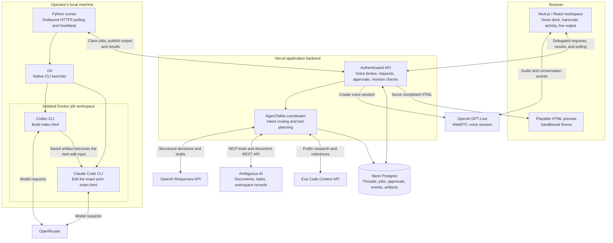

# AgentTalkie

One voice workspace to direct your agents and tools, follow their progress, and review the results.

Every new agent adds another chat, dashboard, or terminal to manage. AgentTalkie connects document work, research, and coding in one conversation, with actual tool output and a playable preview of what the coding agents build.

[Watch the 2:05 demo](https://agenttalkie.app/#demo) · [Open the live workspace](https://agenttalkie.app/workspace)

The recording is public. The live workspace requires a demo access code and configured providers.

## What we built

The recorded workflow uses four integrations in the same conversation:

1. **Ambiguous AI:** draft a Personal EA job description, approve the save, and open the resulting document in Ambiguous.
2. **Exa:** retrieve public research and inspect the returned source references.
3. **Codex through Ori:** create a playable tic-tac-toe game in a fresh workspace, with native CLI output visible in the dashboard.
4. **Claude Code through Ori:** edit the exact HTML file Codex produced, changing the game colors while retaining its behavior.

The generated app runs inside AgentTalkie. Each successful version has a content hash and parent artifact reference. The previous working preview stays available while an edit runs or if it fails.

The app also supports direct Ambiguous task creation and updates with approval and readback, conversation history, new conversations, question corrections, and explicit pending, failed, and unknown outcomes. A proposed action is shown separately from a completed tool call.

## How it works



The browser talks to the hosted application. The local runner polls that application over outbound HTTPS, so the demo does not require a public localhost port or inbound tunnel. OpenRouter provides model access; Ori launches the CLI processes, and AgentTalkie displays their returned output.

## Stack and toolsets

| Component | Role in this build |
| --- | --- |
| Next.js 15, React 19, TypeScript | Public landing page, authenticated workspace, API routes, and embedded demo video |
| OpenAI GPT-Live / WebRTC | Spoken conversation and client delegation to the application |
| OpenAI Responses API | Structured intent classification, document drafting, and direct-tool planning |
| Ambiguous AI | Document create/readback over REST; schema-discovered workspace tools over MCP, with reviewed mutations |
| Exa | Public research through the Code Context endpoint, with returned references |
| Ori + OpenRouter | Launch native coding harnesses with configured model routing |
| Codex + Claude Code | Build and edit real files; publish native output, session receipts, and artifacts |
| Python + Docker | Local job execution with a dedicated filesystem mount and resource limits |
| Neon Postgres | Durable conversations, selected task context, job queue, output, approvals, and artifact versions |
| CopilotKit / AG-UI | Inherited web provider and runtime infrastructure; AgentTalkie's live workflow uses its own request and event APIs |
| Vercel + Cloudflare | Application and public video hosting on Vercel; custom-domain DNS on Cloudflare |
| 1Password CLI | Operator-managed secret injection without committing credentials |

See [architecture and execution details](docs/architecture.md) and the [runner setup](tools/agenttalkie-runner/README.md).

## Run locally

Requires Node.js 22+, npm, a Neon Postgres database, and credentials for the integrations you intend to use. Coding jobs additionally require Python 3, Docker, Ori, and the runner configuration described below.

```sh
npm ci
cp .env.example .env
```

The example file includes starter settings. Configure these additional live-workspace values in the ignored root `.env`, or inject them through your secret manager:

| Variable | Purpose |
| --- | --- |
| `DATABASE_URL` | Neon connection string |
| `AGENTTALKIE_DEMO_SECRET` | Demo access code and cookie-signing secret, at least 32 characters |
| `OPENAI_API_KEY` | Coordinator model access and the configured GPT-Live voice API |
| `AGENTTALKIE_LIVE_VOICE_ENABLED=true` | Enable the live voice broker after account access is configured |
| `AMBIGUOUS_API_KEY` | Credential for the intended Ambiguous workspace |
| `EXA_API_KEY` | Exa research access |
| `AGENTTALKIE_TASK_ID` | Optional existing demo task reference; direct discovery and creation are also supported |

Apply [the live schema](apps/web/scripts/live-schema.sql) to your Neon database using its SQL editor, then run:

```sh
npm run dev:web
```

Open `http://127.0.0.1:3100/workspace` and unlock it with your configured demo access code. Voice requires account access to the API used by [the voice broker](apps/web/src/lib/server/agenttalkie-voice.ts). Provider calls consume the connected accounts' usage.

For coding jobs, build the worker image and follow the [runner instructions](tools/agenttalkie-runner/README.md) to configure Ori, inject credentials, and start the bounded polling process:

```sh
docker build -t agenttalkie-demo-worker:1 tools/agenttalkie-runner
```

Keep the runner running while demonstrating Codex and Claude. Creating a new conversation does not start a runner.

```sh
npm run verify
npm run build --workspace web
```

These checks validate code and application behavior. Live provider access and microphone behavior require a separate end-to-end rehearsal.

## Known gaps

- This is a shared, password-gated hackathon workspace, not individual-user authentication or a multi-tenant product. Auth0 is present as a starter recipe, not the live demo's authentication system.
- The verified coding harnesses are Codex and Claude Code. Other fleet adapters, including OpenClaw, are not connected by this demo.
- Coding availability depends on the local runner's heartbeat and job/time limits. It does not automatically run forever.
- Generated apps are self-contained HTML artifacts, not full repository deployments. The preview permits inline scripts but blocks network access; artifact links require workspace access.
- Ambiguous documents were verified in its browser. API-created tasks support create/update/readback, but their visibility in the human task list remains unresolved. Tool catalog discovery does not establish permission to execute every tool.
- The Exa integration currently uses Code Context, not the full Exa search product surface.
- Writes require review. Account administration, sharing changes, and autonomous Ambiguous assistant execution are excluded. Uncertain writes are not automatically retried.
- Docker limits the worker filesystem and resources, but allows outbound model requests. Only the job directory is mounted, and model credentials needed by the CLI are available to that process.

## Origin

Built at AI Tinkerers Agents Everywhere on September 12, 2026, from the MIT-licensed [CopilotKit Agents Everywhere starter](https://github.com/CopilotKit/agents-everywhere-starter-kit), snapshot `86f547d74e8bd32e047226b0e1fb862cca02a5c7`. [STARTER-PROVENANCE.json](STARTER-PROVENANCE.json) records the inherited baseline. AgentTalkie's voice workflow, coordination, direct-tool approval flow, durable job runner, artifact handoff, and interface were built after that baseline.

Original starter documentation is retained in [docs/starter.md](docs/starter.md). The public recording is documented in [apps/web/DEMO.md](apps/web/DEMO.md).
