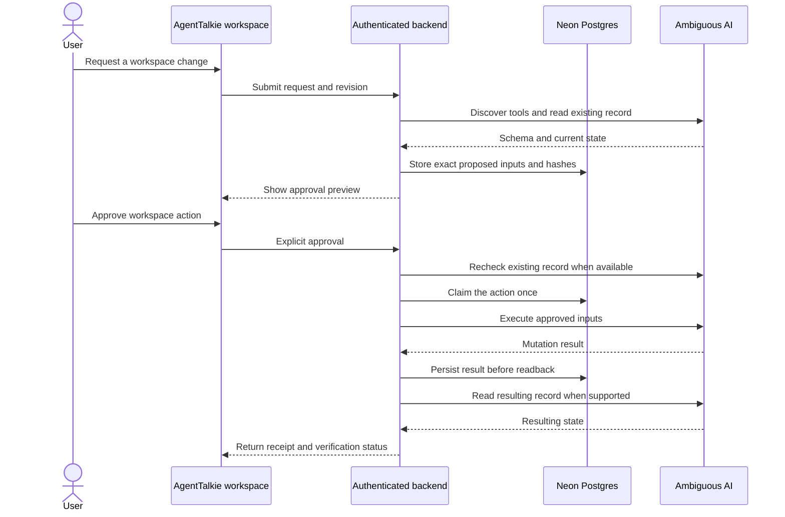
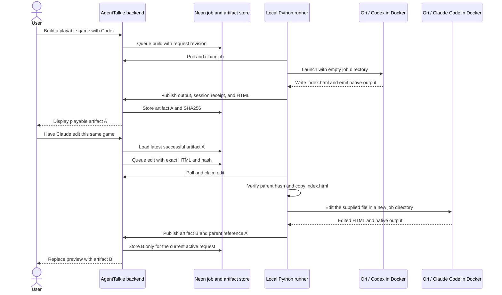

# AgentTalkie architecture

This describes the implemented web demo as of September 12, 2026. See the [README](../README.md#how-it-works) for the system diagram and toolset map, and the [public recording](https://agenttalkie.app/#demo) for the user workflow.

## Voice and request handling

The public landing page serves a recorded demo without connecting to live providers. `/workspace` mounts the React workspace, CopilotKit provider, AgentTalkie state, and voice dock. Live endpoints check the signed demo cookie and permitted origin. The current access model is one shared demo owner.

The server brokers an OpenAI GPT-Live session, then the browser exchanges audio and conversation events over WebRTC. Substantive requests are delegated back through the client to AgentTalkie's authenticated API. Typed input reaches the same coordinator. OpenAI Responses supplies structured interpretation, document drafts, and tool-planning decisions; those model responses are not coding-worker receipts.

The coordinator routes requests to document drafting/saving, direct Ambiguous tools, Exa retrieval, or a durable coding job. Neon Postgres stores threads, revisions, events, selected task context, approvals, jobs, output, and HTML artifacts. The UI polls the live endpoints for progress and results.

## Direct tools and approval

Ambiguous's MCP catalog supplies tool names and input schemas. The connector filters excluded operations and validates model-selected inputs. Reads can execute immediately; mutations produce an exact preview tied to the current request, schema hash, and prior record snapshot when a getter exists.

Document drafting also has a dedicated path: prepare the title and body, accept `save this document` after review, POST a restricted Ambiguous document, then GET it and compare its title, content, and visibility. Direct workspace actions use `approve workspace action`. The voice model must not approve its own proposal.

An uncertain write remains unknown and is not automatically repeated. A saved provider ID allows investigation without blindly creating a duplicate. Catalog presence is not proof of provider permissions. Human-browser task visibility remains a known gap even when API readback succeeds.

Exa retrieval currently calls its Code Context endpoint with a public query. The response supplies research context and references. Private workspace content and identifiers must not be sent as public research queries.

## Cloud-to-local coding execution

The Python runner makes outbound authenticated HTTPS requests to the Vercel app, advertises its capabilities, and sends heartbeats. It claims a durable job, invokes Ori locally, publishes bounded native output, and returns the native session receipt and result. No browser-to-localhost connection or inbound tunnel is required.

Ori is the trusted host-side launcher and model configuration boundary. Its CLI shim starts the actual Codex or Claude Code binary inside the worker image. OpenRouter handles their model requests; it does not host the dashboard terminal or run the local process.

Each build/edit container mounts only its job directory. The root filesystem is read-only, the process runs as a non-root user, Linux capabilities are dropped, and execution has memory, CPU, process-count, and time limits. The host home, app checkout, Docker socket, and credential files are not mounted. Required model credentials are available inside the process; the container has outbound networking for model calls. Codex's inner sandbox is disabled inside this Docker boundary. Claude's enabled tools are Read, Write, Edit, Grep, and Glob.

Published terminal output excludes reasoning and diagnostics and redacts known credential values. HTML and result content containing known credential values are rejected. The dashboard terminal is an output viewer, not an arbitrary-command shell.

## Artifact and revision boundaries

Completed HTML is stored with its owner, job, hash, harness, and parent artifact. The authenticated artifact route serves it with a restrictive Content Security Policy. The iframe allows scripts without same-origin access and blocks network requests, nested frames, forms, and external resources. This is an embedded HTML app, not a separate Vercel deployment.

An edit consumes the latest successful artifact in the same thread, including after intervening workspace requests. Failed edits leave the prior preview available. Ending a conversation or changing the active request prevents a late job result from replacing the current preview. Suppressing a result does not cancel a remote process or retract audio already played.

Neon also retains the selected Ambiguous task ID across turns, so a later completion request can target the same task and include the latest artifact URL. That mutation still requires the normal exact-input review.

## Source map

| Area | Source |
| --- | --- |
| Voice broker and host instructions | `apps/web/src/lib/server/agenttalkie-voice.ts` |
| Intent routing and job creation | `apps/web/src/lib/server/agenttalkie-coordinator.ts` |
| MCP discovery, approval, execution | `apps/web/src/lib/server/agenttalkie-direct-tools.ts` |
| Tool filtering and input validation | `apps/web/src/lib/server/agenttalkie-tool-policy.ts` |
| Document draft/save/readback | `apps/web/src/lib/server/agenttalkie-documents.ts` |
| Durable schema and thread state | `apps/web/scripts/live-schema.sql`, `apps/web/src/lib/server/agenttalkie-live-store.ts` |
| Runner protocol | `apps/web/src/app/api/agenttalkie/runner/route.ts` |
| Native execution and output filtering | `tools/agenttalkie-runner/` |
| Artifact storage and parent validation | `apps/web/src/lib/server/agenttalkie-artifacts.ts` |
| Browser preview and terminal | `apps/web/src/components/agenttalkie/artifact-preview.tsx`, `runner-terminal.tsx` |

The starter also includes Slack/mobile examples, Auth0 recipes, and additional adapter code. Their presence does not mean those integrations are connected in this demo.
