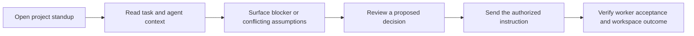
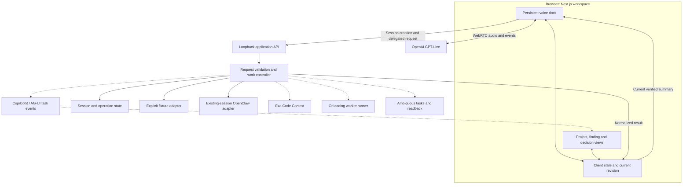
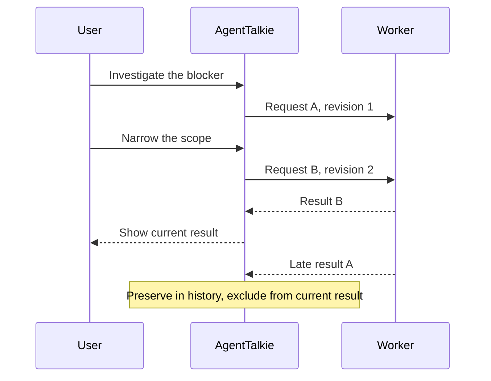

# AgentTalkie architecture

Status: implementation scaffold plus integration plan, September 12, 2026. Source inspected; no live end-to-end provider verification claimed.

## Product flow



This is the target experience. The current fixture supports a single-worker request, correction, evidence and prepared follow-up. Multi-worker comparison and external writes remain planned.

## Runtime boundaries



Solid lines identify scaffold paths in code, not proven live integrations. Dashed lines are planned integration boundaries. The Live broker is disabled by default. The OpenClaw adapter is disconnected by default. CopilotKit is inherited infrastructure; the custom AgentTalkie task event integration remains planned. Current storage is process-local, not durable.

GPT-Live supplies the conversational interface. AgentTalkie owns request interpretation, selected task/session identity, permissions, revision checks and results. OpenRouter can provide a model through an appropriate worker route; it does not import existing CLI sessions. An existing worker session, new Ori job, voice session and application thread are separate identities.

## Correction behavior



Scope steering uses only a supported worker interface. Until acknowledgement, the UI must distinguish queued from accepted. Suppressing a late result does not cancel remote work or retract audio already played.

## Files and ownership

```text
apps/web/src/
  app/                         Page, styles and API routes
    api/agenttalkie/           Session, question, follow-up and voice endpoints
  components/agenttalkie/      Workspace, persistent provider and dock
  lib/
    agenttalkie-contract.ts   Executable request/result schema
    agenttalkie-fixture.ts    Non-sensitive sample data
    client/                   API client and current-state selection
    voice/                    GPT-Live browser lifecycle
    server/                   Validation and request lifecycle
      agenttalkie-adapters/   Worker adapters
apps/web/e2e/agenttalkie/      Acceptance and source capture
tools/agenttalkie-runner/     Planned isolated worker runner
```

## Before a public deployment

Provide actual user authentication and trusted origin checks, persist application state, verify provider session cleanup, and prove one authorized worker route. Verify writes with a fresh read. A lost response remains unknown until reconciled. API secrets stay server-side; private workers remain behind their authenticated bridge.

The application should remain useful while a worker is pending, unavailable or fails. Show explicit fixture, checkpoint, source-read and worker-reply evidence. Reconnection must restore the work identity without silently creating another task.
